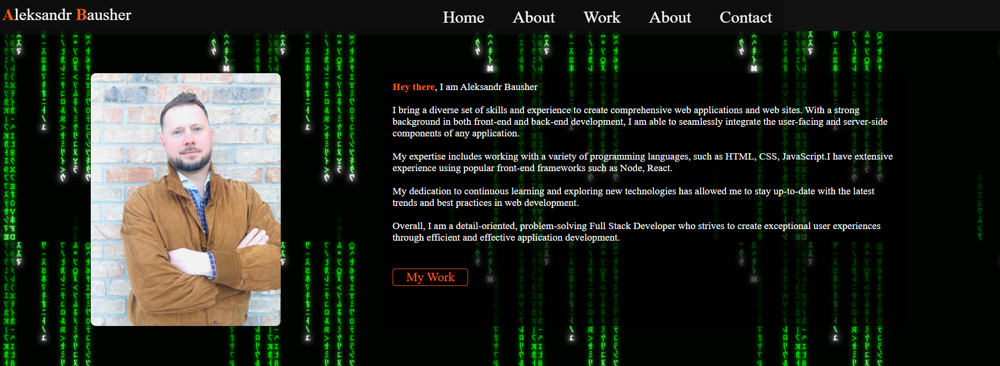
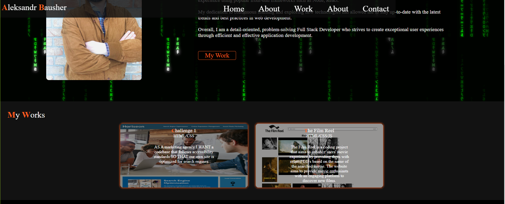
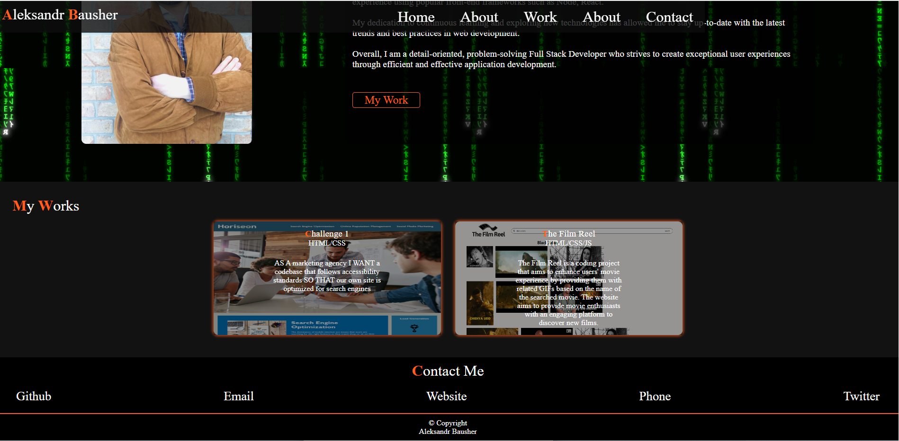

# My Portfolio

## Description

I developed this Portfolio Web Page project to showcase the skills I acquired during my recent studies at the University of Toronto bootcamp. The primary purpose of the project is to attract potential employers who are seeking either part-time or full-time web developers.

My web page features a brief introduction about myself, a profile picture, contact details, and a summary of the projects I have been working on during my time in the bootcamp. Additionally, my portfolio showcases images of deployed web pages. By clicking on the top two images, visitors are redirected to the respective web pages. Furthermore, I have added two more images as placeholders for future projects.

In creating this portfolio, I utilized HTML5 and CSS in Visual Code. The CSS code includes flexbox, which helped me to position the elements and make them flexible, and media queries, which ensured a responsive design for optimal viewing on all devices such as desktops, laptops, iPads, and mobile devices. Finally, I uploaded and pushed the web page to a GitHub Repository named "challenge2".

## Table of contents

- [Installation](#installation)
- [Usage](#usage)
- [Screenshot](#screenshot)
- [Contribution](#contribution)
- [Questions](#questions)
- [License](#license)

## Installation

follow the link of the deployed application [My Portfolio](https://aleksandrbausher.github.io/MyPortfolio/) ,

otherwise clone GitHub repository [My Portfolio](https://github.com/AleksandrBausher/MyPortfolio)

## Usage
click here to access my [Portfolio](https://aleksandrbausher.github.io/MyPortfolio/), 
to know more about me and my projects

## Screenshot

## Contribution

application was created by Aleksandr Bausher and if you want to contribute send me email.

## Questions

My Email:
[aleksandrbausher@gmail.com](mailto:aleksandrbausher@gmail.com)
My Github:
[AleksandrBausher](https://github.com/aleksandrbausher)

## License

